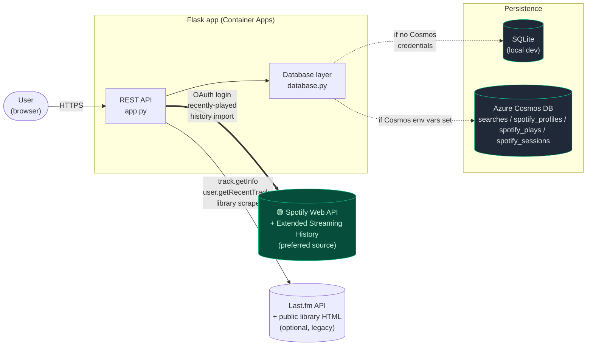
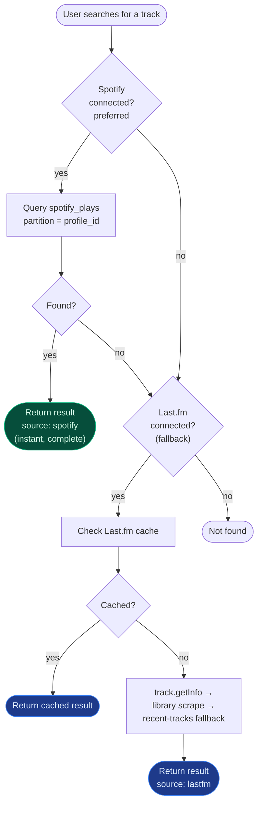
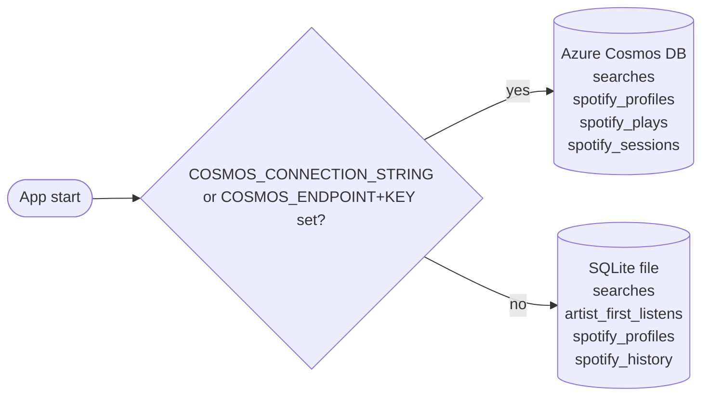
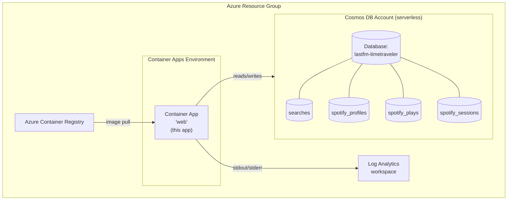

# 🕰️🧑‍🚀 Music Time Traveler

Find the very first time you listened to any song — powered by your **Spotify Extended Streaming History** (recommended), your **Last.fm scrobbles**, or both.

Log in with Spotify (or connect Last.fm), type a song title, pick from the autocomplete suggestions, and discover when you first played it, plus how many times since.

[](https://github.com/jetzlstorfer/music-timetraveler/actions/workflows/lint-build.yml)


## What's new

- 🟢 **Spotify is the preferred data source** — log in with Spotify and you get **the full app**: search, first-listen lookup, top tracks, recent plays, on-this-day, search history, and per-month listening trends — all driven by your imported Spotify history. Spotify wins because it's **instant** (single partition-keyed lookup, no API rate limits) and **complete** (every play back to account creation). Last.fm is fully optional.
- 🔐 **Log in with Spotify** — sign in via the Spotify OAuth flow (Authorization Code + PKCE). Your Spotify user id is your identity, so the same account on phone and desktop sees the same data. No passwords, no share links.
- 🎧 **Spotify import** — upload your Spotify Extended Streaming History (`.json` files or the raw `.zip`) and the app uses your private play data as the **primary** source for first-listen lookups (instant, no API rate limits, complete history back to your first play).
- 🔄 **One-click sync** — once logged in, click **Sync** to pull your last 50 plays from Spotify's `recently-played` API and append them to your imported history.
- 🪞 **Dual-source search** — log into Spotify, connect Last.fm, or both. When both are connected, autocomplete merges results and **Spotify takes priority** (because it's faster and more complete).
- 🎵 **Last.fm (optional, legacy)** — if you've been scrobbling for years and don't have a Spotify export, you can still drive the whole app from a Last.fm username alone.

## Architecture



The same `database.py` API is used regardless of backend. Backend selection is automatic based on environment variables (see [Database](#database)).

## Setup

The app supports three configuration modes:

| Mode | Provides |
|---|---|
| **Spotify only** *(recommended — set the four `SPOTIFY_*` vars)* | The full app driven entirely by your imported Spotify history: search, first-listen, top tracks, on-this-day, etc. Instant lookups, complete history. No Last.fm key required. |
| **Both** | Spotify takes priority for first-listen and search. The Last.fm widgets remain available as a secondary source. |
| **Last.fm only** (set `LASTFM_API_KEY`) | Legacy mode for users with long Last.fm scrobble histories but no Spotify export. |

The `/api/status` and `/api/ready` health endpoints are healthy as long as **at least one** of the two providers is configured.

1. **Set up Spotify** *(recommended)* — see [Setting up Spotify OAuth](#setting-up-spotify-oauth) below. This is the preferred path: instant lookups, full history, no rate limits.

2. **Get a Last.fm API key** at https://www.last.fm/api/account/create *(optional — only needed if you want the Last.fm widgets or are running in Last.fm-only mode. Spotify-only deployments can skip this entirely.)*

3. **Configure environment**:
   ```bash
   cp .env.example .env
   # Edit .env with your Spotify credentials and/or Last.fm API key
   ```

   Optional settings:
   - `LASTFM_LIBRARY_TIMEZONE` — timezone used when converting scraped Last.fm library dates into unix timestamps (default: `Europe/Vienna`).
   - `DB_PATH` — SQLite file path (default: `timetraveler.db`).
   - `COSMOS_CONNECTION_STRING` *(or `COSMOS_ENDPOINT` + `COSMOS_KEY`)* — switch persistence to Azure Cosmos DB.
   - `COSMOS_DATABASE_NAME` / `COSMOS_CONTAINER_NAME` — override default Cosmos names.
   - `SPOTIFY_BULK_INSERT_WORKERS` — parallelism when bulk-inserting Spotify plays into Cosmos (default: `16`).
   - `SPOTIFY_TOUCH_INTERVAL_SECONDS` — minimum interval between profile-TTL refresh writes on Cosmos (default: `3600`, i.e. once per hour). See [Data retention](#data-retention).

4. **Install & run**:
   ```bash
   python -m venv .venv
   source .venv/bin/activate   # Windows: .venv\Scripts\activate
   pip install -r requirements.txt
   python app.py
   ```

5. Open http://localhost:5000

### Dev Container

Open this repo in VS Code with the Dev Containers extension — it will auto-create the venv and install dependencies.

### Running tests and linting

**Lint with Ruff:**
```bash
make lint
```

**Run tests:**
```bash
make test
```

or directly:

```bash
pytest
```

## Spotify

### Setting up Spotify OAuth

The app uses Spotify's [Authorization Code + PKCE](https://developer.spotify.com/documentation/web-api/tutorials/code-pkce-flow) flow with a server-side client secret. To enable it:

1. Create a Spotify app at https://developer.spotify.com/dashboard.
2. Copy the **Client ID** and **Client Secret** into your `.env` (`SPOTIFY_CLIENT_ID`, `SPOTIFY_CLIENT_SECRET`).
3. Add a **Redirect URI** in the Spotify dashboard that exactly matches `SPOTIFY_REDIRECT_URI`. For local dev: `http://127.0.0.1:5000/api/spotify/callback`. For production: `https://<your-host>/api/spotify/callback`.
4. Generate a Fernet key for encrypting refresh tokens at rest:
   ```bash
   python -c "from cryptography.fernet import Fernet; print(Fernet.generate_key().decode())"
   ```
   Store the output as `SPOTIFY_TOKEN_ENCRYPTION_KEY`. **Keep this stable** — rotating it invalidates every stored refresh token (users will have to log in again).

The OAuth scopes requested are `user-read-email user-read-recently-played`. If any of the four env vars above are missing the **Log in with Spotify** button is hidden and the auth endpoints return `503`.

### Logging in & sync

Click **Log in with Spotify** to start the OAuth flow. After you grant access you're redirected back and a `spotify_session` cookie (HttpOnly, `SameSite=Lax`, 30-day TTL) is set. The session id's SHA-256 hash is what's stored server-side; the raw cookie value never leaves your browser.

Once logged in:
- **Sync** calls Spotify's `/v1/me/player/recently-played` to fetch your last 50 plays and merges them into your imported history (deduplicated).
- **Logout** removes the server-side session and clears the cookie.

The sync API only returns the most recent 50 plays — for years of history use the GDPR export below.

### How to import your full history (GDPR export)

1. Log into https://www.spotify.com/account/privacy and request your **Extended Streaming History** (not the basic one — the extended export contains every play back to account creation, with full track metadata and play timestamps).
2. Spotify emails you a download link within ~5 days. The download is a `.zip` containing one or more `Streaming_History_Audio_*.json` files.
3. In the app, log in with Spotify, then drop the whole `.zip` into the upload box or select the individual `.json` files. Up to 500 MB per upload.

### What gets imported

Each play in the export becomes one row, after filtering:

- **Music only** — podcasts and audiobooks (where `master_metadata_track_name` is null) are skipped.
- **30-second minimum** — plays under 30 s are skipped, matching Spotify's own counting threshold. The "filtered" number you see after upload is the count of plays excluded for these reasons.
- **Re-uploads are deduplicated** — a deterministic per-play ID means uploading the same file twice doesn't create duplicates.

### Data retention

When the Cosmos DB backend is in use (production), Spotify data has a **90-day TTL** that is refreshed on every authenticated access:

- The profile document's TTL is bumped on each successful request you make (throttled to once per `SPOTIFY_TOUCH_INTERVAL_SECONDS`, default 1 hour).
- Play documents' TTLs are refreshed by re-uploading your Spotify export — the deterministic dedup means it's a safe no-op for plays you already have.
- If you stop using the app for 90 days, your imported data is automatically deleted. Re-upload at any time to restore it.

The local SQLite backend has no expiry — data lives until you delete the file or click **Disconnect**.

### How lookup works with both sources



### Clearing data & logging out

- **Clear data** (`DELETE /api/spotify/data`) removes every play document from `spotify_plays` for your profile but keeps your session and profile so you can re-upload.
- **Logout** (`POST /api/spotify/logout`) deletes the server-side session record and clears the cookie. Your imported plays and profile remain — log in again with the same Spotify account to access them.
- To fully purge a profile, log out and revoke the app from your Spotify account settings; the profile + plays expire automatically after the 90-day TTL on the Cosmos backend.

## Database

The app supports two persistence modes, chosen automatically:



| Cosmos container | Partition key | Holds |
|---|---|---|
| `searches` | `/username_normalized` | Last.fm first-listen cache + per-artist first-listen cache |
| `spotify_profiles` | `/profile_id_normalized` | One doc per Spotify user — display name + Fernet-encrypted refresh token + last-sync timestamp |
| `spotify_plays` | `/profile_id_normalized` | One doc per Spotify play (deterministic SHA-1 ID for natural dedup) |
| `spotify_sessions` | `/session_id_hash` | Server-side session records (SHA-256 of the session cookie value), 30-day TTL |

Per-user partitioning means every Spotify query is a single-partition lookup — fast and RU-cheap.

To run the Cosmos path locally, start the Azure Cosmos DB emulator in Docker and point the app at it:

```bash
docker pull mcr.microsoft.com/cosmosdb/linux/azure-cosmos-emulator:vnext-preview
docker run -d -p 8081:8081 -p 1234:1234 mcr.microsoft.com/cosmosdb/linux/azure-cosmos-emulator:vnext-preview

export COSMOS_CONNECTION_STRING='AccountEndpoint=http://localhost:8081/;AccountKey=<emulator-key>;'
python app.py
```

The emulator exposes the database endpoint on `http://localhost:8081` and the local data explorer on `http://localhost:1234`. The required containers are created on demand.

## Deploy to Azure

This project includes everything needed to deploy to **Azure Container Apps** using the [Azure Developer CLI (azd)](https://aka.ms/azd).

### Prerequisites

- [Azure CLI](https://learn.microsoft.com/cli/azure/install-azure-cli)
- [Azure Developer CLI (azd)](https://learn.microsoft.com/azure/developer/azure-developer-cli/install-azd)
- An Azure subscription

### One-command deployment

```bash
azd up
```

This single command will:
1. Build and push the Docker image to **Azure Container Registry**
2. Provision all infrastructure (**Container Apps Environment**, **Container App**, **Log Analytics**, **Azure Cosmos DB for NoSQL** with the four containers above)
3. Deploy the application to **Azure Container Apps**

`azd up` is idempotent — re-running it just reconciles any new containers (e.g. `spotify_profiles`, `spotify_plays`, `spotify_sessions`). **No data migration is needed**: existing Last.fm cache data stays untouched.

### Provisioned topology



You will be prompted for:
- `AZURE_ENV_NAME` — a short name for this environment (e.g. `lastfm-prod`)
- `AZURE_LOCATION` — Azure region (e.g. `eastus`)
- `LASTFM_API_KEY` — your Last.fm API key (stored as a secret)
- `SPOTIFY_CLIENT_ID` / `SPOTIFY_CLIENT_SECRET` — your Spotify app credentials (stored as secrets)
- `SPOTIFY_REDIRECT_URI` — must be `https://<your-host>/api/spotify/callback` and registered in the Spotify dashboard
- `SPOTIFY_TOKEN_ENCRYPTION_KEY` — a Fernet key (see [Spotify](#spotify))

The Cosmos connection string is wired into the Container App as a secret reference — you don't need to set it manually.

The resource group, Container App, Container Apps environment, and Log Analytics workspace names are derived from `AZURE_ENV_NAME`. The Azure Container Registry name also uses `AZURE_ENV_NAME`, with a short stable hash suffix because registry names must be globally unique and alphanumeric.

With `lastfm-timetraveler`, the default app URL will be similar to:

```text
https://ca-lastfm-timetraveler.<managed-environment-suffix>.swedencentral.azurecontainerapps.io
```

### CI/CD with GitHub Actions

The `.github/workflows/azure-aca-deploy.yml` workflow runs `azd provision` and `azd deploy` automatically on every push to `main`.

**Required GitHub repository variables** (`Settings → Secrets and variables → Actions`):

| Name | Kind | Description |
|------|------|-------------|
| `AZURE_CLIENT_ID` | Variable | App registration client ID (for OIDC) |
| `AZURE_TENANT_ID` | Variable | Azure AD tenant ID |
| `AZURE_SUBSCRIPTION_ID` | Variable | Azure subscription ID |
| `AZURE_ENV_NAME` | Variable | azd environment name |
| `AZURE_LOCATION` | Variable | Azure region (e.g. `eastus`) |
| `LASTFM_API_KEY` | **Secret** | Last.fm API key |
| `SPOTIFY_CLIENT_ID` | **Secret** | Spotify app client id |
| `SPOTIFY_CLIENT_SECRET` | **Secret** | Spotify app client secret |
| `SPOTIFY_REDIRECT_URI` | Variable | OAuth callback URL (`https://<host>/api/spotify/callback`) |
| `SPOTIFY_TOKEN_ENCRYPTION_KEY` | **Secret** | Fernet key for encrypting refresh tokens at rest |

To set up federated credentials (OIDC) for the service principal, follow the [azd GitHub Actions guide](https://learn.microsoft.com/azure/developer/azure-developer-cli/configure-devops-pipeline).

[Dependabot](.github/dependabot.yml) is configured to open weekly PRs for pip, Docker, and GitHub Actions dependency updates.

## How it works

- **Autocomplete** — calls `/api/spotify/search` (your imported plays) and/or Last.fm's `track.search` in parallel; results are merged with **Spotify hits taking priority**.
- **First listen (Spotify, preferred)** — single partition-keyed Cosmos query (or indexed SQLite lookup): `MIN(played_at_unix)` for `(profile_id, track, artist)`. Always instant, no API rate limits, complete history.
- **First listen (Last.fm, fallback)** — `track.getInfo` for play count, then a public-library HTML scrape for the oldest scrobble; falls back to scanning `user.getRecentTracks` pages backward.
- **Async lookups** — `/api/first-listen` returns `202` with a `lookup_id`; the client polls `/api/lookup-progress?lookup_id=` for status. Progress lives in an in-memory dict, not the database.
- **Scrape resilience** — public Last.fm HTML page fetches use retry/backoff for transient failures (timeouts, connection errors, `429`, `5xx`).
- **Caching** — confirmed Last.fm lookups are written to the `searches` container/table. Spotify lookups don't need a cache — they're already instant.
- Built with **Flask** (backend) and vanilla **HTML/CSS/JS** (frontend, single file: [`static/index.html`](static/index.html)).

### Endpoints

| Endpoint | Description |
|---|---|
| `GET /api/status` | Health check — verifies the API key is configured |
| `GET /api/ready` | Readiness probe — tests API key and database connectivity |
| `GET /api/user/validate?username=` | Validates a Last.fm username and returns profile info |
| `GET /api/user/top-tracks?username=&period=` | Top tracks for a user (`7day`, `1month`, `3month`, `6month`, `12month`, `overall`) |
| `GET /api/user/recent-tracks?username=` | Recently scrobbled tracks |
| `GET /api/on-this-day?username=` | What the user listened to on this day 1, 2, 5, and 10 years ago |
| `GET /api/search?q=` | Last.fm autocomplete search (minimum 2 characters) |
| `GET /api/first-listen?track=&artist=&username=&profile_id=` | Find the first scrobble (returns `202` with a `lookup_id` for async polling). Both `username` and `profile_id` are optional but at least one must be provided. |
| `GET /api/lookup-progress?lookup_id=` | Poll progress of an async first-listen lookup |
| `GET /api/artist-image?artist=` | Fetch an image URL for an artist |
| `GET /api/artist-first-listen?artist=&username=&profile_id=` | First time a user heard any track by the given artist |
| `GET /api/history?username=` | All cached first-listen results for the given Last.fm username |
| `GET /api/listening-history?username=&track=&artist=` | Per-week play counts for a track (Last.fm only) |
| `GET /api/spotify/login` | Start the OAuth flow (302 redirect to Spotify) |
| `GET /api/spotify/callback` | OAuth callback — exchanges the auth code for tokens and creates a session |
| `POST /api/spotify/logout` | Delete the server-side session and clear the cookie |
| `GET /api/spotify/status` | Reports `logged_in`, profile id, display name, and import stats |
| `POST /api/spotify/upload` | Multipart upload of `.json` / `.zip` Spotify history files (session required) |
| `GET /api/spotify/import-progress` | Poll progress of an in-flight Spotify history import |
| `POST /api/spotify/sync` | Pull the last 50 plays from Spotify's `recently-played` and append them |
| `DELETE /api/spotify/data` | Clear imported plays for the logged-in user |
| `GET /api/spotify/search?q=` | Autocomplete over the user's imported Spotify tracks |

All `/api/spotify/*` endpoints (except `login`, `callback`, and `status`) require a valid `spotify_session` cookie.
